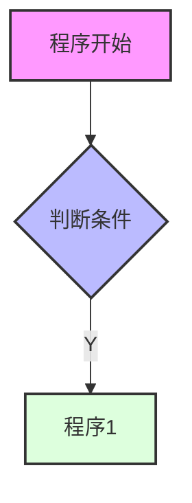
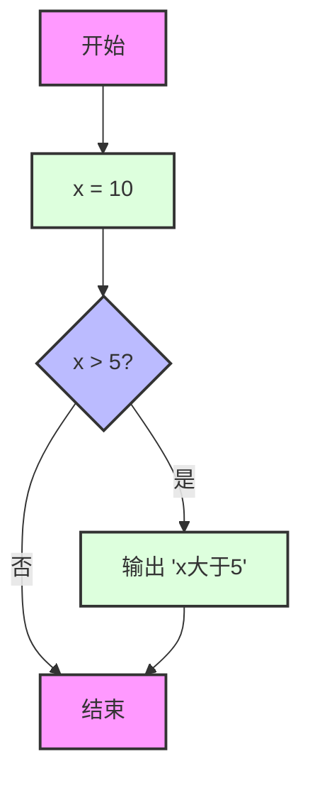
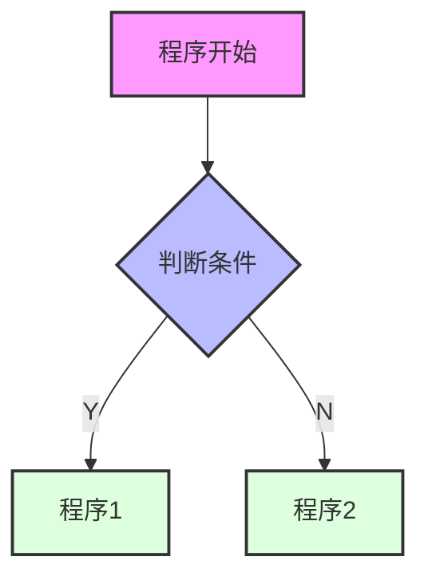
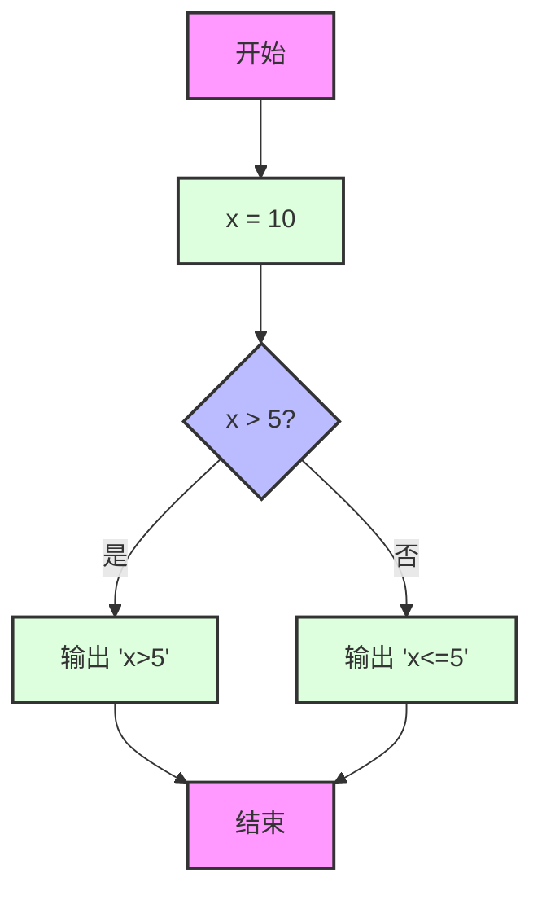
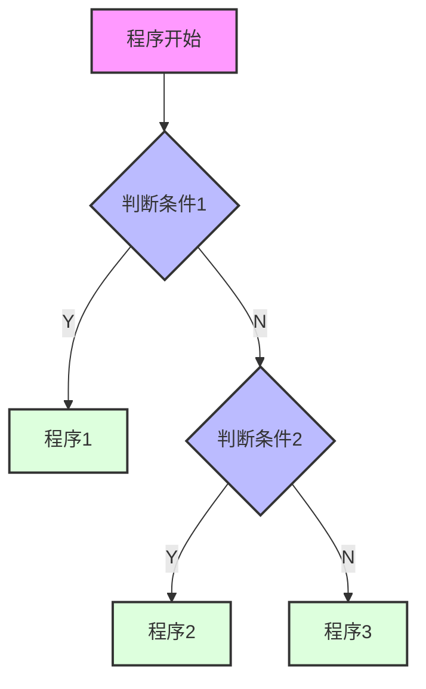
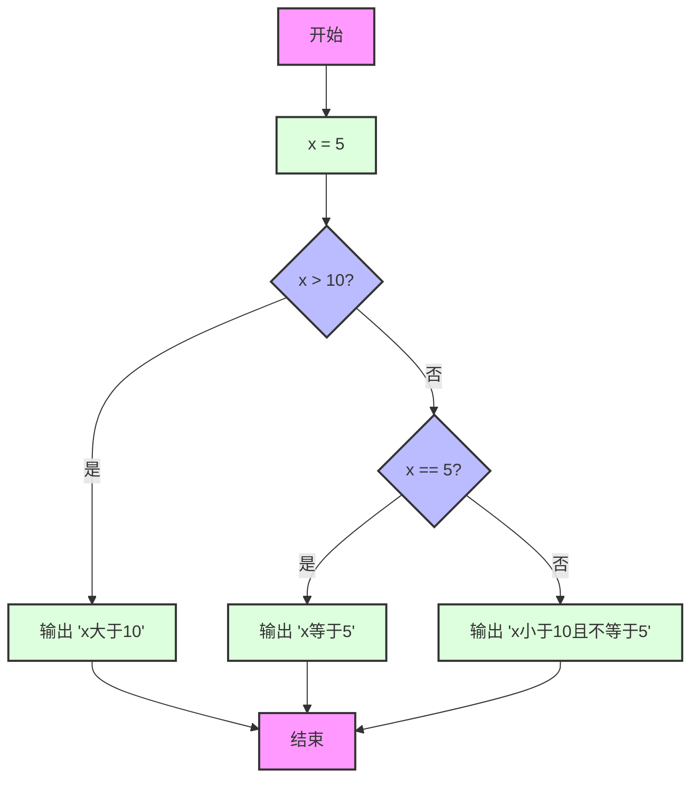
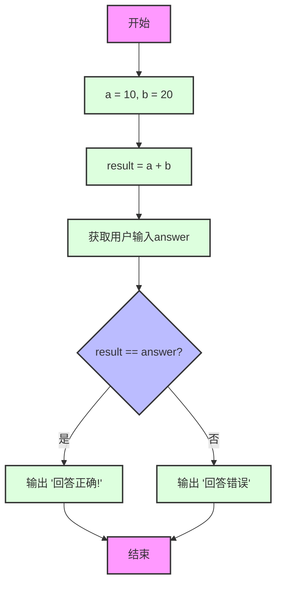
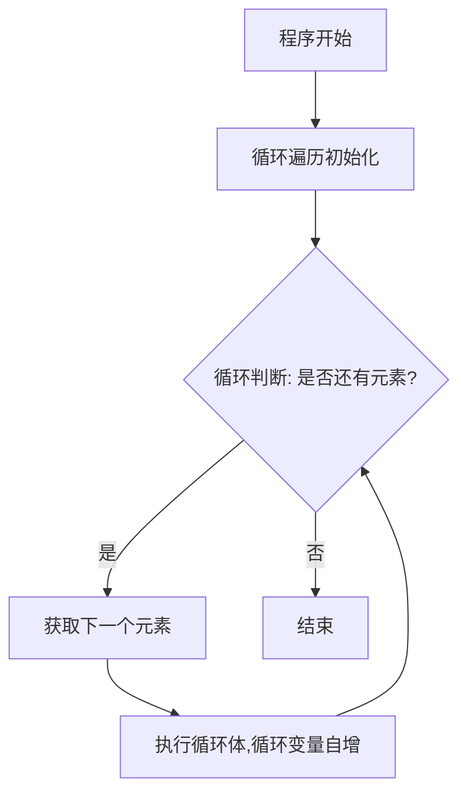

# 赋值&计算

## 赋值语句

（简单回顾）使用 = 进行赋值

| 赋值类型      | 描述                              | 示例                  |
|-----------|---------------------------------|---------------------|
| 基本赋值      | 使用等号（=）进行赋值。                    | `x = 10`            |
| 同一个值给多个变量 | 可以使用同一个值来给多个变量。                 | `x = y = z = 10`    |
| 多重赋值      | 可以同时给多个变量赋多个值。                  | `x, y, z = 1, 2, 3` |
| 使用下划线赋值   | 当你不关心某个值时，可以使用下划线 (`_`) “丢弃”变量。 | `x, _ = 1, 2`       |

## 计算语句

### 基本运算符

| 运算符 | 含义     | 示例                      |
|-----|--------|-------------------------|
| +   | 加法     | 5 + 3 = 8               |
| -   | 减法     | 5 - 3 = 2               |
| *   | 乘法     | 5 * 3 = 15              |
| /   | 算数除法   | 5 / 3 ≈ 1.6666666666667 |
| //  | 整除除法求商 | 5 // 3 = 1              |
| **  | 幂运算    | 5 ** 2 = 25             |
| %   | 求余数    | 5 % 3 = 2               |

### 计算同时赋值

| 运算符 | 运算式     | 相当于        | 结果(假设x=5)  | 最终结果     |
|-----|---------|------------|------------|----------|
| +=  | x += 1  | x = x + 1  | x = 5 + 1  | x = 6    |
| -=  | x -= 1  | x = x - 1  | x = 5 - 1  | x = 4    |
| *=  | x *= 2  | x = x * 2  | x = 5 * 2  | x = 10   |
| /=  | x /= 3  | x = x / 3  | x = 5 / 3  | x ≈ 1.67 |
| //= | x //= 3 | x = x // 3 | x = 5 // 3 | x = 1    |
| **= | x **= 2 | x = x ** 2 | x = 5 ** 2 | x = 25   |
| %=  | x %= 2  | x = x % 2  | x = 5 % 2  | x = 1    |

# 数据格式

## 数据类型

| 数据类型    | 描述       | 示例                                      | 特点                                        |
|---------|----------|-----------------------------------------|-------------------------------------------|
| int     | 整型，整数    | 5, 3, -1                                | 可正数、负数零                                   |
| float   | 浮点数，有小数点 | 3.14, -0.6, 1e-3                        | 有精度限制                                     |
| str     | 字符串，文本数据 | "Hello, World!", 'Python 编程', "这是一段字符串" | - 可以用单引号或双引号<br>- 可存储中文和其他字符<br>- 可用索引和切片 |
| complex | 复数，有实部虚部 | 2+3j, 3-4j                              | j表示虚部                                     |

## 查看数据类型

可以使用type()函数查看数据类型，示例：

```python
a = 1
b = 3.14
c = '123'
d = "这也是字符串"
e = '''这也可以是字符串'''

print("a的数据类型是：", type(a))  # <class 'int'>
print("b的数据类型是：", type(b))  # <class 'float'>
print("c的数据类型是：", type(c))  # <class 'str'>
print("d的数据类型是：", type(d))  # <class 'str'>
print("e的数据类型是：", type(e))  # <class 'str'>
```

## 数据格式转换与实例

### 进制整数

| 进制   | 单个数值范围   | 示例                                             |
|------|----------|------------------------------------------------|
| 10进制 | 0-9      | 0, 2, -1, 3                                    |
| 2进制  | 0-1      | 0(十进制的0)<br>1(十进制的1)<br>10(十进制的2)<br>11(十进制的3) |
| 8进制  | 0-7      | 162 = (1 × 8²) + (6 × 8¹) + (2 × 8⁰) = 114     |
| 16进制 | 0-9, A-F | 64 = (6 × 16¹) + (4 × 16⁰) = 100               |

示例：

```python
# 十进制数42转换为其他进制
num = 42
print(bin(num))  # 输出：0b101010
print(oct(num))  # 输出：0o52
print(hex(num))  # 输出：0x2a

# 其他进制转换为十进制
print(int('101010', 2))  # 二进制转十进制，输出：42
print(int('52', 8))  # 八进制转十进制，输出：42
print(int('2a', 16))  # 十六进制转十进制，输出：42
```

### 转为小数

使用 float() 转为小数：

```python
num_str = input("请输入小数：")
print("num_str = ", num_str, " 格式是: ", type(num_str))
num_float = float(num_str)
print("num_float = ", num_str, " 格式是: ", type(num_float))
```

输出示例：

```
请输入人数：12
num_str = 12 格式是：<class 'str'>
num_float = 12 格式是：<class 'float'>
```

### 转为字符串

#### 使用 str() 转为字符串

```python
name = "Alice"
age = 30
print("My name is %s and I'm %d years old." % (name, age))
print("My name is {} and I'm {} years old.".format(name, age))
print(f"My name is {name} and I'm {age} years old.")
```

### 输出时控制精度

```python
number = 12.3456
print("%.2f" % number)
print("{:.2f}".format(number))
print(f"{number:.2f}")
```

输出结果：

```
12.35
12.35
12.35
```

# 顺序结构语句

顺序结构为从上往下依次执行，通常为赋值语句、计算语句等

# 选择结构语句

## 比较运算符

| 运算符 | 含义                    | 示例     | 结果    | 结果值   |
|-----|-----------------------|--------|-------|-------|
| ==  | 等于，检查两个操作数是否相等        | 5 == 3 | False | false |
| !=  | 不等于，检查两个操作数是否不想等      | 5 != 3 | True  | true  |
| >   | 大于，检查左操作数是否大于右操作数     | 5 > 3  | True  | true  |
| <   | 小于，检查左操作数是否小雨右操作数     | 5 < 3  | False | false |
| >=  | 大于等于，检查左操作数是否大于等于右操作数 | 5 >= 3 | True  | true  |
| <=  | 小于等于，检查左操作数是否小于等于右操作数 | 5 <= 3 | False | false |

## 选择语句

### 1. if语句



示例代码：

```python
x = 10
if x > 5:
    print("x大于5")
```

对应流程图：



### 2. if...else语句



示例代码：

```python
x = 10
if x > 5:
    print("x>5")
else:
    print("x<=5")
```

对应流程图：



### 3. if...elif...else语句



示例代码：

```python
x = 5
if x > 10:
    print("x大于10")
elif x == 5:
    print("x等于5")
else:
    print("x小于10且不等于5")
```

对应流程图：



## 实际应用示例

```python
a = 10
b = 20
result = a + b
answer = int(input(f"请输入{a}+{b}的结果"))
if result == answer:
    print("回答正确！")
else:
    print("回答错误")
```

对应流程图：



# 循环结构语句

## 1. for循环

for循环用于遍历可迭代对象（如列表、元组、字符串等）中的元素。

### for循环流程图



### 基本语法

#### 1. 可指定循环次数

代码示例：

```python
epoch = 5
for epoch_i in range(epoch):
    print("----------")
    print(f"正在处理第{epoch_i + 1}个epoch的数据")
    print(f"第{epoch_i + 1}个数据处理完毕")
```

结果示例：

```text
----------
正在处理第1个epoch的数据
第1个数据处理完毕
----------
正在处理第2个epoch的数据
第2个数据处理完毕
----------
正在处理第3个epoch的数据
第3个数据处理完毕
----------
正在处理第4个epoch的数据
第4个数据处理完毕
----------
正在处理第5个epoch的数据
第5个数据处理完毕
```

#### 2. 可指定迭代对象

代码示例：

```text
optimizes = ["SGD", "Adan", "Momentum", "Adagrad"]
for optimizer_i in optimizes:
    print("正在使用 ", optimizer_i, " 优化器")
```

结果示例：

```text
正在使用  SGD  优化器
正在使用  Adan  优化器
正在使用  Momentum  优化器
正在使用  Adagrad  优化器
```

```python
# 遍历列表
fruits = ["苹果", "香蕉", "橙子"]
for fruit in fruits:
    print(f"我喜欢吃{fruit}")

# 使用range()函数
for i in range(5):
    print(f"当前数字是: {i}")
```

#### 3. 可对数据进行枚举

代码示例：

```python
img_list = ["img_1.png", "img_2.png", "img_3.png", "img_4.png", "img_5.png"]
for index, img_i in enumerate(img_list):
    print(f"正在处理第{index + 1}张图片：", img_i)
```

结果示例：

```text
正在处理第1张图片： img_1.png
正在处理第2张图片： img_2.png
正在处理第3张图片： img_3.png
正在处理第4张图片： img_4.png
正在处理第5张图片： img_5.png
```

## 2. while循环

while循环会在条件为True时持续执行代码块。

### 使用场景

当不清楚应该循环多少次时，用while循环

代码示例：

```python
command = ""
while command != "end":
    command = input("请输入命令：")
    print("正在执行命令：", command)
```

结果示例：

```text
请输入命令：add
正在执行命令： add
请输入命令：clear
正在执行命令： clear
请输入命令：end
正在执行命令： end
```

## 2. break语句

break语句用于提前退出循环，停止循环，跳出整个循环。

### 示例：查找数字5

代码示例：

```python
# 这是一个数字列表，用来查找数字"5"
numbers = [1, 3, 4, 2, 5, 6, 7, 8]
found = False

# 机器人开始逐个查看数字"5"
for number in numbers:
    print(f"正在查看数字{number}")
    if number == 5:
        found = True
        print(f"机器人找到了数字{number}!")
        break  # 找到数字5后立即退出循环

if not found:
    print("机器人没有找到数字5。")
```

结果示例：

```text
正在查看数字1
正在查看数字3
正在查看数字4
正在查看数字2
正在查看数字5
机器人找到了数字5!
```

## 3. continue语句

continue语句用于跳过当前循环的剩余部分，直接进入下一次循环。
continue跳过当前回合，仍在循环当中

### 示例：查找并跳过数字5

代码示例：

```python
# 这是一个数字列表，我们要跳过数字"5"的处理
numbers = [1, 3, 4, 2, 5, 6, 7, 8]

for number in numbers:
    print(f"正在查看数字{number}")
    if number == 5:
        continue  # 如果是数字5，跳过后续处理，直接进入下一次循环
    print(f"机器人找到了数字{number}!")
```

结果示例：

```text
正在查看数字1
机器人找到了数字1!
正在查看数字3
机器人找到了数字3!
正在查看数字4
机器人找到了数字4!
正在查看数字2
机器人找到了数字2!
正在查看数字5
正在查看数字6
机器人找到了数字6!
正在查看数字7
机器人找到了数字7!
正在查看数字8
机器人找到了数字8!
```

## 综合案例

代码示例：

```python
a = 10
b = 20
result = a + b
while True:
    answer = int(input(f"请输入{a}+{b}的结果："))
    if result == answer:
        print("回答正确！")
        break
    else:
        print("回答错误。")
```

结果示例：

```text
请输入10+20的结果：30
回答错误。
请输入10+20的结果：40
回答错误。
请输入10+20的结果：30
回答正确！
```